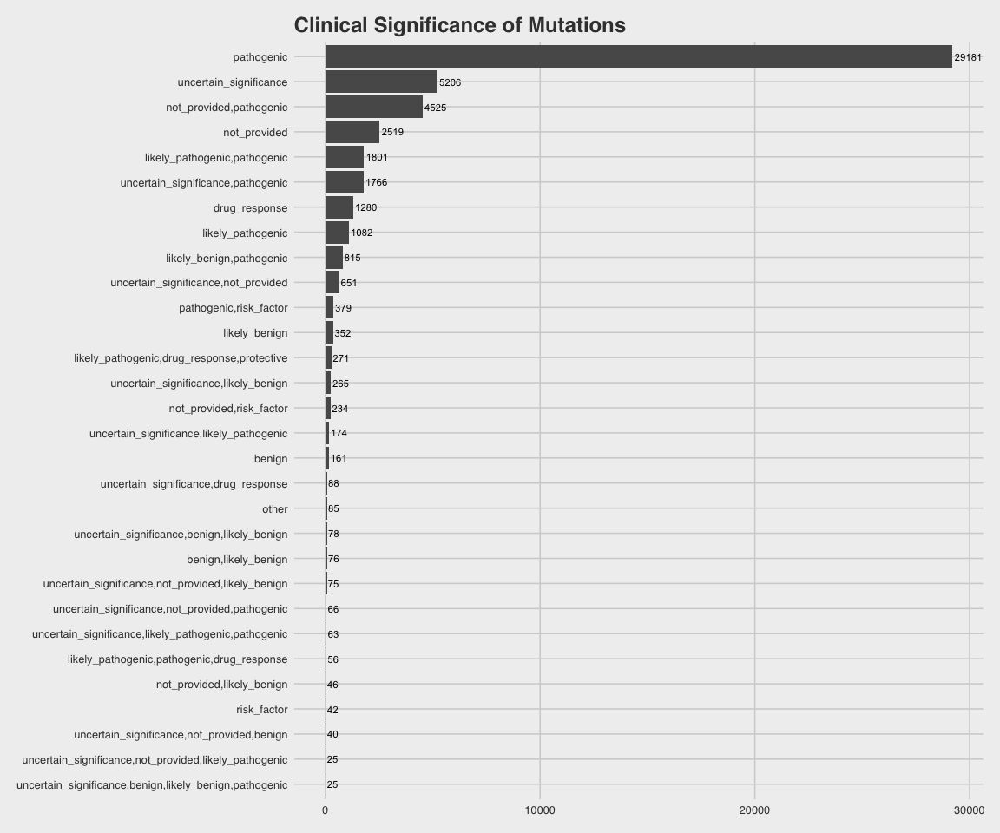

AACR GENIE data access
================
Laura Cosgrove
2/21/2019

Getting Data
------------

``` r
library(tidyverse)
```

    ## ── Attaching packages ─────────────────────────────────────────────────────────────────── tidyverse 1.2.1 ──

    ## ✔ ggplot2 3.1.0     ✔ purrr   0.2.5
    ## ✔ tibble  1.4.2     ✔ dplyr   0.7.8
    ## ✔ tidyr   0.8.2     ✔ stringr 1.3.1
    ## ✔ readr   1.1.1     ✔ forcats 0.3.0

    ## ── Conflicts ────────────────────────────────────────────────────────────────────── tidyverse_conflicts() ──
    ## ✖ dplyr::filter() masks stats::filter()
    ## ✖ dplyr::lag()    masks stats::lag()

``` r
#install.packages("synapser", repos=c("https://sage-bionetworks.github.io/ran", "http://cran.fhcrc.org"))
library(synapser)
```

    ## 
    ## TERMS OF USE NOTICE:
    ##   When using Synapse, remember that the terms and conditions of use require that you:
    ##   1) Attribute data contributors when discussing these data or results from these data.
    ##   2) Not discriminate, identify, or recontact individuals or groups represented by the data.
    ##   3) Use and contribute only data de-identified to HIPAA standards.
    ##   4) Redistribute data only under these same terms of use.

Put your login info here

``` r
#synLogin("laura_cosgrove", "")
```

Download text files

``` r
data_CNA <- synGet("syn17394020", downloadLocation="./data/")

data_clinical_patient <- synGet("syn17394024", downloadLocation="./data/")

data_clinical_sample <- synGet("syn17394030", downloadLocation="./data/")

data_fusions <- synGet("syn17394035", downloadLocation="./data/")

data_guide <- synGet("syn17394098", downloadLocation="./data/")

data_mutations_extended <- synGet("syn17394041", downloadLocation="./data/")
```

Read text files to CSV and save to RData the ones you want to use (bc very big)

``` r
data_CNA <- read.delim("./data/data_CNA_5.0-public.txt")

data_mutations <- read.delim("./data/data_mutations_extended_5.0-public.txt", skip = 1) 

saveRDS(data_mutations, "data_mutations.rds")
```

Initial Exploration
-------------------

Just looked at mutations so far.

``` r
data_mutations <- readRDS("data_mutations.rds")
data_mutations <- data_mutations %>% 
  as_tibble() 

glimpse(data_mutations)
```

    ## Observations: 455,665
    ## Variables: 123
    ## $ Hugo_Symbol                   <fct> KRAS, BRAF, EGFR, TP53, NRAS, PI...
    ## $ Entrez_Gene_Id                <int> 3845, 673, 1956, 7157, 4893, 529...
    ## $ Center                        <fct> JHU, JHU, JHU, JHU, JHU, JHU, JH...
    ## $ NCBI_Build                    <fct> GRCh37, GRCh37, GRCh37, GRCh37, ...
    ## $ Chromosome                    <fct> 12, 7, 7, 17, 1, 3, 3, 3, 3, 4, ...
    ## $ Start_Position                <int> 25398285, 140453136, 55249071, 7...
    ## $ End_Position                  <int> 25398285, 140453136, 55249071, 7...
    ## $ Strand                        <fct> +, +, +, +, +, +, +, +, +, +, +,...
    ## $ Variant_Classification        <fct> Missense_Mutation, Missense_Muta...
    ## $ Variant_Type                  <fct> SNP, SNP, SNP, SNP, SNP, SNP, SN...
    ## $ Reference_Allele              <fct> C, A, C, C, T, A, A, C, A, A, G,...
    ## $ Tumor_Seq_Allele1             <fct> C, A, C, C, T, A, A, C, A, A, G,...
    ## $ Tumor_Seq_Allele2             <fct> A, T, T, T, C, G, G, T, G, G, C,...
    ## $ dbSNP_RS                      <fct> rs121913530, rs113488022, rs1214...
    ## $ dbSNP_Val_Status              <lgl> NA, NA, NA, NA, NA, NA, NA, NA, ...
    ## $ Tumor_Sample_Barcode          <fct> GENIE-JHU-00006-00185, GENIE-JHU...
    ## $ Matched_Norm_Sample_Barcode   <fct> NORMAL, NORMAL, NORMAL, NORMAL, ...
    ## $ Match_Norm_Seq_Allele1        <int> 0, 0, 0, 0, 0, 0, 0, 0, 0, 0, 0,...
    ## $ Match_Norm_Seq_Allele2        <int> 0, 0, 0, 0, 0, 0, 0, 0, 0, 0, 0,...
    ## $ Tumor_Validation_Allele1      <lgl> NA, NA, NA, NA, NA, NA, NA, NA, ...
    ## $ Tumor_Validation_Allele2      <lgl> NA, NA, NA, NA, NA, NA, NA, NA, ...
    ## $ Match_Norm_Validation_Allele1 <lgl> NA, NA, NA, NA, NA, NA, NA, NA, ...
    ## $ Match_Norm_Validation_Allele2 <lgl> NA, NA, NA, NA, NA, NA, NA, NA, ...
    ## $ Verification_Status           <fct> , , , , , , , , , , , , , , , , ...
    ## $ Validation_Status             <lgl> NA, NA, NA, NA, NA, NA, NA, NA, ...
    ## $ Mutation_Status               <fct> , , , , , , , , , , , , , , , , ...
    ## $ Sequencing_Phase              <lgl> NA, NA, NA, NA, NA, NA, NA, NA, ...
    ## $ Sequence_Source               <lgl> NA, NA, NA, NA, NA, NA, NA, NA, ...
    ## $ Validation_Method             <lgl> NA, NA, NA, NA, NA, NA, NA, NA, ...
    ## $ Score                         <fct> , , , , , , , , , , , , , , , , ...
    ## $ BAM_File                      <int> 185, 185, 185, 185, 185, 185, 18...
    ## $ Sequencer                     <lgl> NA, NA, NA, NA, NA, NA, NA, NA, ...
    ## $ Tumor_Sample_UUID             <lgl> NA, NA, NA, NA, NA, NA, NA, NA, ...
    ## $ Matched_Norm_Sample_UUID      <lgl> NA, NA, NA, NA, NA, NA, NA, NA, ...
    ## $ HGVSc                         <fct> c.34G>T, c.1799T>A, c.2369C>T, c...
    ## $ HGVSp                         <fct> p.Gly12Cys, p.Val600Glu, p.Thr79...
    ## $ HGVSp_Short                   <fct> p.G12C, p.V600E, p.T790M, p.R273...
    ## $ Transcript_ID                 <fct> ENST00000256078, ENST00000288602...
    ## $ Exon_Number                   <fct> 2/6, 15/18, 20/28, 8/11, 3/7, 21...
    ## $ t_depth                       <int> 1623, 1031, 692, 930, 2277, 1064...
    ## $ t_ref_count                   <int> 1247, 913, 624, 820, 2067, 917, ...
    ## $ t_alt_count                   <int> 376, 118, 68, 110, 210, 147, 67,...
    ## $ n_depth                       <int> 0, 0, 0, 0, 0, 0, 0, 0, 0, 0, 0,...
    ## $ n_ref_count                   <int> NA, NA, NA, NA, NA, NA, NA, NA, ...
    ## $ n_alt_count                   <int> NA, NA, NA, NA, NA, NA, NA, NA, ...
    ## $ all_effects                   <fct> KRAS,missense_variant,p.Gly12Cys...
    ## $ Allele                        <fct> A, T, T, T, C, G, G, T, G, G, C,...
    ## $ Gene                          <fct> ENSG00000133703, ENSG00000157764...
    ## $ Feature                       <fct> ENST00000256078, ENST00000288602...
    ## $ Feature_type                  <fct> Transcript, Transcript, Transcri...
    ## $ Consequence                   <fct> missense_variant, missense_varia...
    ## $ cDNA_position                 <fct> 98/1119, 1860/2480, 2546/9821, 1...
    ## $ CDS_position                  <fct> 34/570, 1799/2301, 2369/3633, 81...
    ## $ Protein_position              <fct> 12/189, 600/766, 790/1210, 273/3...
    ## $ Amino_acids                   <fct> G/C, V/E, T/M, R/H, Q/R, H/R, Q/...
    ## $ Codons                        <fct> Ggt/Tgt, gTg/gAg, aCg/aTg, cGt/c...
    ## $ Existing_variation            <fct> rs121913530,COSM516,COSM1140136,...
    ## $ ALLELE_NUM                    <int> 1, 1, 1, 1, 1, 1, 1, 1, 1, 1, 1,...
    ## $ DISTANCE                      <int> NA, NA, NA, NA, NA, NA, NA, NA, ...
    ## $ STRAND_VEP                    <int> -1, -1, 1, -1, -1, 1, 1, 1, 1, 1...
    ## $ SYMBOL                        <fct> KRAS, BRAF, EGFR, TP53, NRAS, PI...
    ## $ SYMBOL_SOURCE                 <fct> HGNC, HGNC, HGNC, HGNC, HGNC, HG...
    ## $ HGNC_ID                       <int> 6407, 1097, 3236, 11998, 7989, 8...
    ## $ BIOTYPE                       <fct> protein_coding, protein_coding, ...
    ## $ CANONICAL                     <fct> YES, YES, YES, YES, YES, YES, YE...
    ## $ CCDS                          <fct> CCDS8703.1, CCDS5863.1, CCDS5514...
    ## $ ENSP                          <fct> ENSP00000256078, ENSP00000288602...
    ## $ SWISSPROT                     <fct> P01116, P15056, P00533, P04637, ...
    ## $ TREMBL                        <fct> Q9UM97,Q71SP6,P78460,L7RSL8,I1SR...
    ## $ UNIPARC                       <fct> UPI0000133132, UPI000013DF26, UP...
    ## $ RefSeq                        <fct> NM_033360.2, NM_004333.4, NM_005...
    ## $ SIFT                          <fct> deleterious(0.04), deleterious(0...
    ## $ PolyPhen                      <fct> probably_damaging(0.993), probab...
    ## $ EXON                          <fct> 2/6, 15/18, 20/28, 8/11, 3/7, 21...
    ## $ INTRON                        <fct> , , , , , , , , , , , , , , , , ...
    ## $ DOMAINS                       <fct> Gene3D:3.40.50.300,Pfam_domain:P...
    ## $ GMAF                          <fct> , , , T:0.0002, , , , , , , , , ...
    ## $ AFR_MAF                       <fct> , , , T:0,T:0, , , , , , , , , ,...
    ## $ AMR_MAF                       <fct> , , , T:0,T:0, , , , , , , , , ,...
    ## $ ASN_MAF                       <lgl> NA, NA, NA, NA, NA, NA, NA, NA, ...
    ## $ EAS_MAF                       <fct> , , , T:0,T:0, , , , , , , , , ,...
    ## $ EUR_MAF                       <fct> , , , T:0.001,T:0.001, , , , , ,...
    ## $ SAS_MAF                       <fct> , , , T:0,T:0, , , , , , , , , ,...
    ## $ AA_MAF                        <fct> , , , , , , , , , , , , , , , , ...
    ## $ EA_MAF                        <fct> , , , , , , , , , , , , , , , , ...
    ## $ CLIN_SIG                      <fct> not_provided,pathogenic, pathoge...
    ## $ SOMATIC                       <fct> 0,1,1, 1,1, 0,1, 0,0,1,1,1,1, 0,...
    ## $ PUBMED                        <fct> , 21499247, , 25105660, 25032700...
    ## $ MOTIF_NAME                    <lgl> NA, NA, NA, NA, NA, NA, NA, NA, ...
    ## $ MOTIF_POS                     <lgl> NA, NA, NA, NA, NA, NA, NA, NA, ...
    ## $ HIGH_INF_POS                  <lgl> NA, NA, NA, NA, NA, NA, NA, NA, ...
    ## $ MOTIF_SCORE_CHANGE            <lgl> NA, NA, NA, NA, NA, NA, NA, NA, ...
    ## $ IMPACT                        <fct> MODERATE, MODERATE, MODERATE, MO...
    ## $ PICK                          <int> 1, 1, 1, 1, 1, 1, 1, 1, 1, 1, NA...
    ## $ VARIANT_CLASS                 <fct> SNV, SNV, SNV, SNV, SNV, SNV, SN...
    ## $ TSL                           <lgl> NA, NA, NA, NA, NA, NA, NA, NA, ...
    ## $ HGVS_OFFSET                   <int> NA, NA, NA, NA, NA, NA, NA, NA, ...
    ## $ PHENO                         <fct> 1,1,1, 1,1, 1,1, 1,0,1,1,1,1, 1,...
    ## $ MINIMISED                     <int> 1, 1, 1, 1, 1, 1, 1, 1, 1, 1, 1,...
    ## $ ExAC_AF                       <dbl> NA, NA, NA, NA, NA, NA, NA, NA, ...
    ## $ ExAC_AF_AFR                   <dbl> NA, NA, NA, NA, NA, NA, NA, NA, ...
    ## $ ExAC_AF_AMR                   <dbl> NA, NA, NA, NA, NA, NA, NA, NA, ...
    ## $ ExAC_AF_EAS                   <dbl> NA, NA, NA, NA, NA, NA, NA, NA, ...
    ## $ ExAC_AF_FIN                   <dbl> NA, NA, NA, NA, NA, NA, NA, NA, ...
    ## $ ExAC_AF_NFE                   <dbl> NA, NA, NA, NA, NA, NA, NA, NA, ...
    ## $ ExAC_AF_OTH                   <dbl> NA, NA, NA, NA, NA, NA, NA, NA, ...
    ## $ ExAC_AF_SAS                   <dbl> NA, NA, NA, NA, NA, NA, NA, NA, ...
    ## $ GENE_PHENO                    <int> 1, 1, 1, 1, 1, 1, 1, 1, 1, 1, 1,...
    ## $ FILTER                        <fct> PASS, PASS, PASS, PASS, PASS, PA...
    ## $ flanking_bps                  <fct> CCA, CAC, ACG, ACG, TTG, CAT, CA...
    ## $ variant_id                    <fct> ., ., ., ., ., ., ., ., ., ., .,...
    ## $ variant_qual                  <fct> ., ., ., ., ., ., ., ., ., ., .,...
    ## $ ExAC_AF_Adj                   <dbl> NA, NA, NA, NA, NA, NA, NA, NA, ...
    ## $ ExAC_AC_AN_Adj                <fct> , , , , , , , , , , , , 2/102848...
    ## $ ExAC_AC_AN                    <fct> , , , , , , , , , , , , 2/106194...
    ## $ ExAC_AC_AN_AFR                <fct> , , , , , , , , , , , , 0/8900, ...
    ## $ ExAC_AC_AN_AMR                <fct> , , , , , , , , , , , , 1/10824,...
    ## $ ExAC_AC_AN_EAS                <fct> , , , , , , , , , , , , 0/7824, ...
    ## $ ExAC_AC_AN_FIN                <fct> , , , , , , , , , , , , 0/6502, ...
    ## $ ExAC_AC_AN_NFE                <fct> , , , , , , , , , , , , 1/52204,...
    ## $ ExAC_AC_AN_OTH                <fct> , , , , , , , , , , , , 0/674, ,...
    ## $ ExAC_AC_AN_SAS                <fct> , , , , , , , , , , , , 0/15920,...
    ## $ ExAC_FILTER                   <fct> , , , , , , , , , , , , PASS, , ...

There's one potential response variable - Clinical Significance. Let's examine that more closely:

``` r
data_mutations %>% 
  group_by(CLIN_SIG) %>% 
  summarize(count = n()) %>% 
  filter(!CLIN_SIG == "") %>% #Count of 404077 dropped
  mutate(clin_sig = forcats::fct_reorder(CLIN_SIG, count)) %>% 
  top_n(30) %>% 
  ggplot(aes(x = clin_sig, y = count)) +
  geom_col() +
  geom_text(aes(label = count), hjust = -0.1, size = 3) +
  coord_flip() + 
  labs(title = "Clinical Significance of Mutations") +
  ggthemes::theme_fivethirtyeight()
```

    ## Selecting by clin_sig



There's a lot of missing data (404,077 obs) and the vast majority of what's remaining is coded either pathogenic or uncertain, and then a lot of multiple-coded values. Maybe not worth looking at this as a response.
