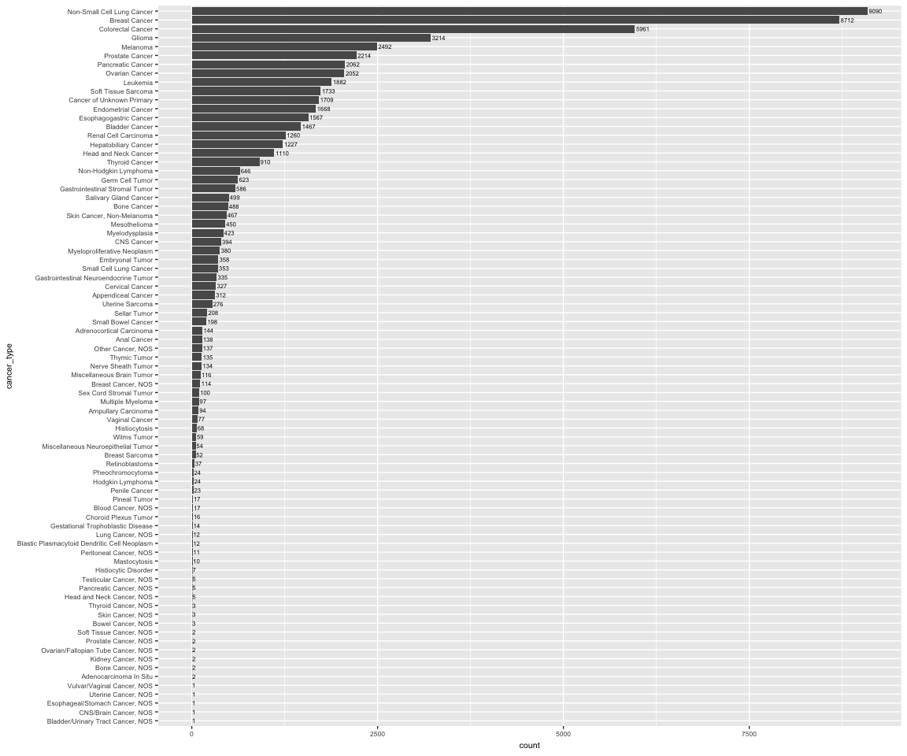

AACR GENIE data access
================
Laura Cosgrove
2/21/2019

Getting Data
------------

``` r
library(tidyverse)
```

    ## ── Attaching packages ─────────────────────────────────────────────────────── tidyverse 1.2.1 ──

    ## ✔ ggplot2 3.1.0     ✔ purrr   0.2.5
    ## ✔ tibble  1.4.2     ✔ dplyr   0.7.8
    ## ✔ tidyr   0.8.2     ✔ stringr 1.3.1
    ## ✔ readr   1.1.1     ✔ forcats 0.3.0

    ## ── Conflicts ────────────────────────────────────────────────────────── tidyverse_conflicts() ──
    ## ✖ dplyr::filter() masks stats::filter()
    ## ✖ dplyr::lag()    masks stats::lag()

``` r
#install.packages("synapser", repos=c("https://sage-bionetworks.github.io/ran", "http://cran.fhcrc.org"))
library(synapser)
```

    ## 
    ## TERMS OF USE NOTICE:
    ##   When using Synapse, remember that the terms and conditions of use require that you:
    ##   1) Attribute data contributors when discussing these data or results from these data.
    ##   2) Not discriminate, identify, or recontact individuals or groups represented by the data.
    ##   3) Use and contribute only data de-identified to HIPAA standards.
    ##   4) Redistribute data only under these same terms of use.

Put your login info here

``` r
#synLogin("laura_cosgrove", "")
```

Download text files

``` r
#data_CNA <- synGet("syn17394020", downloadLocation="./data/")

#data_clinical_patient <- synGet("syn17394024", downloadLocation="./data/")

#data_clinical_sample <- synGet("syn17394030", downloadLocation="./data/")

#data_fusions <- synGet("syn17394035", downloadLocation="./data/")

#data_guide <- synGet("syn17394098", downloadLocation="./data/")

#data_mutations_extended <- synGet("syn17394041", downloadLocation="./data/")
```

Read text files to CSV and save to RData the ones you want to use (bc very big)

``` r
#data_CNA <- read.delim("./data/data_CNA_5.0-public.txt")

#data_mutations <- read.delim("./data/data_mutations_extended_5.0-public.txt", skip = 1) 

#data_clinical_patient <- read.delim("./data/data_clinical_patient_5.0-public.txt", skip = 4) 

#data_clinical_sample <- read.delim("./data/data_clinical_sample_5.0-public.txt",  skip = 4) 

#saveRDS(data_mutations, "data_mutations.rds")
#saveRDS(data_CNA, "data_CNA.rds")
#saveRDS(data_clinical_patient, "data_clinical_patient.rds")
#saveRDS(data_clinical_sample, "data_clinical_sample.rds")
```

Initial Exploration
-------------------

### Mutations dataset

``` r
data_mutations <- readRDS("data_mutations.rds")
data_mutations <- data_mutations %>% 
  as_tibble() 

glimpse(data_mutations)
```

    ## Observations: 455,665
    ## Variables: 123
    ## $ Hugo_Symbol                   <fct> KRAS, BRAF, EGFR, TP53, NRAS, PI...
    ## $ Entrez_Gene_Id                <int> 3845, 673, 1956, 7157, 4893, 529...
    ## $ Center                        <fct> JHU, JHU, JHU, JHU, JHU, JHU, JH...
    ## $ NCBI_Build                    <fct> GRCh37, GRCh37, GRCh37, GRCh37, ...
    ## $ Chromosome                    <fct> 12, 7, 7, 17, 1, 3, 3, 3, 3, 4, ...
    ## $ Start_Position                <int> 25398285, 140453136, 55249071, 7...
    ## $ End_Position                  <int> 25398285, 140453136, 55249071, 7...
    ## $ Strand                        <fct> +, +, +, +, +, +, +, +, +, +, +,...
    ## $ Variant_Classification        <fct> Missense_Mutation, Missense_Muta...
    ## $ Variant_Type                  <fct> SNP, SNP, SNP, SNP, SNP, SNP, SN...
    ## $ Reference_Allele              <fct> C, A, C, C, T, A, A, C, A, A, G,...
    ## $ Tumor_Seq_Allele1             <fct> C, A, C, C, T, A, A, C, A, A, G,...
    ## $ Tumor_Seq_Allele2             <fct> A, T, T, T, C, G, G, T, G, G, C,...
    ## $ dbSNP_RS                      <fct> rs121913530, rs113488022, rs1214...
    ## $ dbSNP_Val_Status              <lgl> NA, NA, NA, NA, NA, NA, NA, NA, ...
    ## $ Tumor_Sample_Barcode          <fct> GENIE-JHU-00006-00185, GENIE-JHU...
    ## $ Matched_Norm_Sample_Barcode   <fct> NORMAL, NORMAL, NORMAL, NORMAL, ...
    ## $ Match_Norm_Seq_Allele1        <int> 0, 0, 0, 0, 0, 0, 0, 0, 0, 0, 0,...
    ## $ Match_Norm_Seq_Allele2        <int> 0, 0, 0, 0, 0, 0, 0, 0, 0, 0, 0,...
    ## $ Tumor_Validation_Allele1      <lgl> NA, NA, NA, NA, NA, NA, NA, NA, ...
    ## $ Tumor_Validation_Allele2      <lgl> NA, NA, NA, NA, NA, NA, NA, NA, ...
    ## $ Match_Norm_Validation_Allele1 <lgl> NA, NA, NA, NA, NA, NA, NA, NA, ...
    ## $ Match_Norm_Validation_Allele2 <lgl> NA, NA, NA, NA, NA, NA, NA, NA, ...
    ## $ Verification_Status           <fct> , , , , , , , , , , , , , , , , ...
    ## $ Validation_Status             <lgl> NA, NA, NA, NA, NA, NA, NA, NA, ...
    ## $ Mutation_Status               <fct> , , , , , , , , , , , , , , , , ...
    ## $ Sequencing_Phase              <lgl> NA, NA, NA, NA, NA, NA, NA, NA, ...
    ## $ Sequence_Source               <lgl> NA, NA, NA, NA, NA, NA, NA, NA, ...
    ## $ Validation_Method             <lgl> NA, NA, NA, NA, NA, NA, NA, NA, ...
    ## $ Score                         <fct> , , , , , , , , , , , , , , , , ...
    ## $ BAM_File                      <int> 185, 185, 185, 185, 185, 185, 18...
    ## $ Sequencer                     <lgl> NA, NA, NA, NA, NA, NA, NA, NA, ...
    ## $ Tumor_Sample_UUID             <lgl> NA, NA, NA, NA, NA, NA, NA, NA, ...
    ## $ Matched_Norm_Sample_UUID      <lgl> NA, NA, NA, NA, NA, NA, NA, NA, ...
    ## $ HGVSc                         <fct> c.34G>T, c.1799T>A, c.2369C>T, c...
    ## $ HGVSp                         <fct> p.Gly12Cys, p.Val600Glu, p.Thr79...
    ## $ HGVSp_Short                   <fct> p.G12C, p.V600E, p.T790M, p.R273...
    ## $ Transcript_ID                 <fct> ENST00000256078, ENST00000288602...
    ## $ Exon_Number                   <fct> 2/6, 15/18, 20/28, 8/11, 3/7, 21...
    ## $ t_depth                       <int> 1623, 1031, 692, 930, 2277, 1064...
    ## $ t_ref_count                   <int> 1247, 913, 624, 820, 2067, 917, ...
    ## $ t_alt_count                   <int> 376, 118, 68, 110, 210, 147, 67,...
    ## $ n_depth                       <int> 0, 0, 0, 0, 0, 0, 0, 0, 0, 0, 0,...
    ## $ n_ref_count                   <int> NA, NA, NA, NA, NA, NA, NA, NA, ...
    ## $ n_alt_count                   <int> NA, NA, NA, NA, NA, NA, NA, NA, ...
    ## $ all_effects                   <fct> KRAS,missense_variant,p.Gly12Cys...
    ## $ Allele                        <fct> A, T, T, T, C, G, G, T, G, G, C,...
    ## $ Gene                          <fct> ENSG00000133703, ENSG00000157764...
    ## $ Feature                       <fct> ENST00000256078, ENST00000288602...
    ## $ Feature_type                  <fct> Transcript, Transcript, Transcri...
    ## $ Consequence                   <fct> missense_variant, missense_varia...
    ## $ cDNA_position                 <fct> 98/1119, 1860/2480, 2546/9821, 1...
    ## $ CDS_position                  <fct> 34/570, 1799/2301, 2369/3633, 81...
    ## $ Protein_position              <fct> 12/189, 600/766, 790/1210, 273/3...
    ## $ Amino_acids                   <fct> G/C, V/E, T/M, R/H, Q/R, H/R, Q/...
    ## $ Codons                        <fct> Ggt/Tgt, gTg/gAg, aCg/aTg, cGt/c...
    ## $ Existing_variation            <fct> rs121913530,COSM516,COSM1140136,...
    ## $ ALLELE_NUM                    <int> 1, 1, 1, 1, 1, 1, 1, 1, 1, 1, 1,...
    ## $ DISTANCE                      <int> NA, NA, NA, NA, NA, NA, NA, NA, ...
    ## $ STRAND_VEP                    <int> -1, -1, 1, -1, -1, 1, 1, 1, 1, 1...
    ## $ SYMBOL                        <fct> KRAS, BRAF, EGFR, TP53, NRAS, PI...
    ## $ SYMBOL_SOURCE                 <fct> HGNC, HGNC, HGNC, HGNC, HGNC, HG...
    ## $ HGNC_ID                       <int> 6407, 1097, 3236, 11998, 7989, 8...
    ## $ BIOTYPE                       <fct> protein_coding, protein_coding, ...
    ## $ CANONICAL                     <fct> YES, YES, YES, YES, YES, YES, YE...
    ## $ CCDS                          <fct> CCDS8703.1, CCDS5863.1, CCDS5514...
    ## $ ENSP                          <fct> ENSP00000256078, ENSP00000288602...
    ## $ SWISSPROT                     <fct> P01116, P15056, P00533, P04637, ...
    ## $ TREMBL                        <fct> Q9UM97,Q71SP6,P78460,L7RSL8,I1SR...
    ## $ UNIPARC                       <fct> UPI0000133132, UPI000013DF26, UP...
    ## $ RefSeq                        <fct> NM_033360.2, NM_004333.4, NM_005...
    ## $ SIFT                          <fct> deleterious(0.04), deleterious(0...
    ## $ PolyPhen                      <fct> probably_damaging(0.993), probab...
    ## $ EXON                          <fct> 2/6, 15/18, 20/28, 8/11, 3/7, 21...
    ## $ INTRON                        <fct> , , , , , , , , , , , , , , , , ...
    ## $ DOMAINS                       <fct> Gene3D:3.40.50.300,Pfam_domain:P...
    ## $ GMAF                          <fct> , , , T:0.0002, , , , , , , , , ...
    ## $ AFR_MAF                       <fct> , , , T:0,T:0, , , , , , , , , ,...
    ## $ AMR_MAF                       <fct> , , , T:0,T:0, , , , , , , , , ,...
    ## $ ASN_MAF                       <lgl> NA, NA, NA, NA, NA, NA, NA, NA, ...
    ## $ EAS_MAF                       <fct> , , , T:0,T:0, , , , , , , , , ,...
    ## $ EUR_MAF                       <fct> , , , T:0.001,T:0.001, , , , , ,...
    ## $ SAS_MAF                       <fct> , , , T:0,T:0, , , , , , , , , ,...
    ## $ AA_MAF                        <fct> , , , , , , , , , , , , , , , , ...
    ## $ EA_MAF                        <fct> , , , , , , , , , , , , , , , , ...
    ## $ CLIN_SIG                      <fct> not_provided,pathogenic, pathoge...
    ## $ SOMATIC                       <fct> 0,1,1, 1,1, 0,1, 0,0,1,1,1,1, 0,...
    ## $ PUBMED                        <fct> , 21499247, , 25105660, 25032700...
    ## $ MOTIF_NAME                    <lgl> NA, NA, NA, NA, NA, NA, NA, NA, ...
    ## $ MOTIF_POS                     <lgl> NA, NA, NA, NA, NA, NA, NA, NA, ...
    ## $ HIGH_INF_POS                  <lgl> NA, NA, NA, NA, NA, NA, NA, NA, ...
    ## $ MOTIF_SCORE_CHANGE            <lgl> NA, NA, NA, NA, NA, NA, NA, NA, ...
    ## $ IMPACT                        <fct> MODERATE, MODERATE, MODERATE, MO...
    ## $ PICK                          <int> 1, 1, 1, 1, 1, 1, 1, 1, 1, 1, NA...
    ## $ VARIANT_CLASS                 <fct> SNV, SNV, SNV, SNV, SNV, SNV, SN...
    ## $ TSL                           <lgl> NA, NA, NA, NA, NA, NA, NA, NA, ...
    ## $ HGVS_OFFSET                   <int> NA, NA, NA, NA, NA, NA, NA, NA, ...
    ## $ PHENO                         <fct> 1,1,1, 1,1, 1,1, 1,0,1,1,1,1, 1,...
    ## $ MINIMISED                     <int> 1, 1, 1, 1, 1, 1, 1, 1, 1, 1, 1,...
    ## $ ExAC_AF                       <dbl> NA, NA, NA, NA, NA, NA, NA, NA, ...
    ## $ ExAC_AF_AFR                   <dbl> NA, NA, NA, NA, NA, NA, NA, NA, ...
    ## $ ExAC_AF_AMR                   <dbl> NA, NA, NA, NA, NA, NA, NA, NA, ...
    ## $ ExAC_AF_EAS                   <dbl> NA, NA, NA, NA, NA, NA, NA, NA, ...
    ## $ ExAC_AF_FIN                   <dbl> NA, NA, NA, NA, NA, NA, NA, NA, ...
    ## $ ExAC_AF_NFE                   <dbl> NA, NA, NA, NA, NA, NA, NA, NA, ...
    ## $ ExAC_AF_OTH                   <dbl> NA, NA, NA, NA, NA, NA, NA, NA, ...
    ## $ ExAC_AF_SAS                   <dbl> NA, NA, NA, NA, NA, NA, NA, NA, ...
    ## $ GENE_PHENO                    <int> 1, 1, 1, 1, 1, 1, 1, 1, 1, 1, 1,...
    ## $ FILTER                        <fct> PASS, PASS, PASS, PASS, PASS, PA...
    ## $ flanking_bps                  <fct> CCA, CAC, ACG, ACG, TTG, CAT, CA...
    ## $ variant_id                    <fct> ., ., ., ., ., ., ., ., ., ., .,...
    ## $ variant_qual                  <fct> ., ., ., ., ., ., ., ., ., ., .,...
    ## $ ExAC_AF_Adj                   <dbl> NA, NA, NA, NA, NA, NA, NA, NA, ...
    ## $ ExAC_AC_AN_Adj                <fct> , , , , , , , , , , , , 2/102848...
    ## $ ExAC_AC_AN                    <fct> , , , , , , , , , , , , 2/106194...
    ## $ ExAC_AC_AN_AFR                <fct> , , , , , , , , , , , , 0/8900, ...
    ## $ ExAC_AC_AN_AMR                <fct> , , , , , , , , , , , , 1/10824,...
    ## $ ExAC_AC_AN_EAS                <fct> , , , , , , , , , , , , 0/7824, ...
    ## $ ExAC_AC_AN_FIN                <fct> , , , , , , , , , , , , 0/6502, ...
    ## $ ExAC_AC_AN_NFE                <fct> , , , , , , , , , , , , 1/52204,...
    ## $ ExAC_AC_AN_OTH                <fct> , , , , , , , , , , , , 0/674, ,...
    ## $ ExAC_AC_AN_SAS                <fct> , , , , , , , , , , , , 0/15920,...
    ## $ ExAC_FILTER                   <fct> , , , , , , , , , , , , PASS, , ...

There's a potential response variable - Clinical Significance. Let's examine that more closely:

``` r
data_mutations %>% 
  group_by(CLIN_SIG) %>% 
  summarize(count = n()) %>% 
  filter(!CLIN_SIG == "") %>% #Count of 404077 dropped
  mutate(clin_sig = forcats::fct_reorder(CLIN_SIG, count)) %>% 
  top_n(30) %>% 
  ggplot(aes(x = clin_sig, y = count)) +
  geom_col() +
  geom_text(aes(label = count), hjust = -0.1, size = 3) +
  coord_flip() + 
  labs(title = "Clinical Significance of Mutations") +
  ggthemes::theme_fivethirtyeight()
```

    ## Selecting by clin_sig


There's a lot of missing data (404,077 obs) and the vast majority of what's remaining is coded either pathogenic or uncertain, and then a lot of multiple-coded values. Maybe not worth looking at this as a response, but rather simply subsetting on pathogenic mutations.

``` r
data_mutations %>% 
  distinct(VARIANT_CLASS)
```

    ## # A tibble: 8 x 1
    ##   VARIANT_CLASS      
    ##   <fct>              
    ## 1 SNV                
    ## 2 deletion           
    ## 3 insertion          
    ## 4 substitution       
    ## 5 indel              
    ## 6 sequence_alteration
    ## 7 RPL                
    ## 8 DUP:TANDEM

There's a few variant classes of mutations.

### CNA dataset

``` r
data_CNA <- readRDS("data_CNA.rds")

 data_CNA %>% 
  as_tibble() %>% 
  drop_na() %>% 
  select(GENIE.DFCI.009135.6818:GENIE.DFCI.009016.6436)  %>% # Just a random selection of samples so easier to see 
  skimr::skim()
```

    ## Skim summary statistics
    ##  n obs: 54 
    ##  n variables: 53 
    ## 
    ## ── Variable type:integer ───────────────────────────────────────────────────────────────────────
    ##                variable missing complete  n   mean   sd p0 p25 p50 p75
    ##  GENIE.DFCI.000059.6433       0       54 54  0.037 0.33 -1   0   0   0
    ##  GENIE.DFCI.000370.6608       0       54 54 -0.17  0.64 -1  -1   0   0
    ##  GENIE.DFCI.000733.6707       0       54 54  0     0     0   0   0   0
    ##  GENIE.DFCI.000741.6740       0       54 54  0.037 0.27 -1   0   0   0
    ##  GENIE.DFCI.001433.1105       0       54 54  0     0     0   0   0   0
    ##  GENIE.DFCI.001591.6626       0       54 54 -0.17  0.64 -1  -1   0   0
    ##  GENIE.DFCI.001657.6646       0       54 54  0     0     0   0   0   0
    ##  GENIE.DFCI.002275.1103       0       54 54  0.056 0.56 -1   0   0   0
    ##  GENIE.DFCI.002365.6793       0       54 54 -0.11  0.42 -2   0   0   0
    ##  GENIE.DFCI.002904.6699       0       54 54  0.019 0.41 -1   0   0   0
    ##  GENIE.DFCI.003233.6749       0       54 54  0.019 0.14  0   0   0   0
    ##  GENIE.DFCI.003442.6619       0       54 54  0.13  0.75 -2   0   0   1
    ##  GENIE.DFCI.003562.1102       0       54 54  0     0     0   0   0   0
    ##  GENIE.DFCI.003764.6688       0       54 54  0.11  0.32  0   0   0   0
    ##  GENIE.DFCI.004241.6625       0       54 54  0.037 0.67 -1   0   0   0
    ##  GENIE.DFCI.004252.6566       0       54 54 -0.056 0.3  -1   0   0   0
    ##  GENIE.DFCI.005022.1116       0       54 54 -0.15  0.49 -2   0   0   0
    ##  GENIE.DFCI.005217.6702       0       54 54 -0.074 0.26 -1   0   0   0
    ##  GENIE.DFCI.005412.6766       0       54 54  0     0     0   0   0   0
    ##  GENIE.DFCI.005447.6795       0       54 54  0     0     0   0   0   0
    ##  GENIE.DFCI.006624.6745       0       54 54 -0.019 0.14 -1   0   0   0
    ##  GENIE.DFCI.007919.6769       0       54 54  0.056 0.71 -1   0   0   0
    ##  GENIE.DFCI.008017.6742       0       54 54  0     0     0   0   0   0
    ##  GENIE.DFCI.008375.6423       0       54 54 -0.11  0.32 -1   0   0   0
    ##  GENIE.DFCI.008398.6691       0       54 54 -0.15  0.63 -1  -1   0   0
    ##  GENIE.DFCI.008536.6580       0       54 54  0     0     0   0   0   0
    ##  GENIE.DFCI.009016.6436       0       54 54  0     0     0   0   0   0
    ##  GENIE.DFCI.009070.6633       0       54 54  0     0     0   0   0   0
    ##  GENIE.DFCI.009081.6592       0       54 54 -0.093 0.49 -1   0   0   0
    ##  GENIE.DFCI.009096.6726       0       54 54  0     0     0   0   0   0
    ##  GENIE.DFCI.009106.6785       0       54 54  0     0     0   0   0   0
    ##  GENIE.DFCI.009124.6747       0       54 54 -0.056 0.23 -1   0   0   0
    ##  GENIE.DFCI.009133.6649       0       54 54  0     0     0   0   0   0
    ##  GENIE.DFCI.009135.6818       0       54 54  0     0     0   0   0   0
    ##  GENIE.DFCI.009166.6767       0       54 54  0     0.34 -1   0   0   0
    ##  GENIE.DFCI.009177.6604       0       54 54 -0.074 0.26 -1   0   0   0
    ##  GENIE.DFCI.009202.6640       0       54 54  0.074 0.38 -1   0   0   0
    ##  GENIE.DFCI.009208.6657       0       54 54  0     0     0   0   0   0
    ##  GENIE.DFCI.009215.6627       0       54 54  0     0     0   0   0   0
    ##  GENIE.DFCI.009217.6670       0       54 54  0     0     0   0   0   0
    ##  GENIE.DFCI.009231.6733       0       54 54  0     0     0   0   0   0
    ##  GENIE.DFCI.009244.6764       0       54 54  0     0     0   0   0   0
    ##  GENIE.DFCI.009258.6581       0       54 54 -0.13  0.48 -1   0   0   0
    ##  GENIE.DFCI.009260.6409       0       54 54  0.037 0.61 -2   0   0   0
    ##  GENIE.DFCI.009261.6703       0       54 54 -0.093 0.45 -1   0   0   0
    ##  GENIE.DFCI.009264.6686       0       54 54  0     0     0   0   0   0
    ##  GENIE.DFCI.009277.6754       0       54 54  0     0     0   0   0   0
    ##  GENIE.DFCI.009279.6681       0       54 54  0     0.19 -1   0   0   0
    ##  GENIE.DFCI.009292.6729       0       54 54  0     0     0   0   0   0
    ##  GENIE.DFCI.009297.6390       0       54 54  0     0     0   0   0   0
    ##  GENIE.DFCI.009312.6572       0       54 54 -0.13  0.34 -1   0   0   0
    ##  GENIE.DFCI.009317.6585       0       54 54 -0.11  0.42 -2   0   0   0
    ##  GENIE.DFCI.009357.6382       0       54 54  0     0     0   0   0   0
    ##  p100     hist
    ##     2 ▁▁▇▁▁▁▁▁
    ##     1 ▅▁▁▇▁▁▁▂
    ##     0 ▁▁▁▇▁▁▁▁
    ##     1 ▁▁▁▇▁▁▁▁
    ##     0 ▁▁▁▇▁▁▁▁
    ##     1 ▅▁▁▇▁▁▁▂
    ##     0 ▁▁▁▇▁▁▁▁
    ##     1 ▂▁▁▇▁▁▁▂
    ##     0 ▁▁▁▁▁▁▁▇
    ##     1 ▁▁▁▇▁▁▁▁
    ##     1 ▇▁▁▁▁▁▁▁
    ##     1 ▁▁▃▁▁▇▁▆
    ##     0 ▁▁▁▇▁▁▁▁
    ##     1 ▇▁▁▁▁▁▁▁
    ##     1 ▃▁▁▇▁▁▁▃
    ##     1 ▁▁▁▇▁▁▁▁
    ##     1 ▁▁▂▁▁▇▁▁
    ##     0 ▁▁▁▁▁▁▁▇
    ##     0 ▁▁▁▇▁▁▁▁
    ##     0 ▁▁▁▇▁▁▁▁
    ##     0 ▁▁▁▁▁▁▁▇
    ##     2 ▃▁▇▁▁▃▁▁
    ##     0 ▁▁▁▇▁▁▁▁
    ##     0 ▁▁▁▁▁▁▁▇
    ##     1 ▃▁▁▇▁▁▁▂
    ##     0 ▁▁▁▇▁▁▁▁
    ##     0 ▁▁▁▇▁▁▁▁
    ##     0 ▁▁▁▇▁▁▁▁
    ##     1 ▂▁▁▇▁▁▁▁
    ##     0 ▁▁▁▇▁▁▁▁
    ##     0 ▁▁▁▇▁▁▁▁
    ##     0 ▁▁▁▁▁▁▁▇
    ##     0 ▁▁▁▇▁▁▁▁
    ##     0 ▁▁▁▇▁▁▁▁
    ##     1 ▁▁▁▇▁▁▁▁
    ##     0 ▁▁▁▁▁▁▁▇
    ##     2 ▁▁▇▁▁▁▁▁
    ##     0 ▁▁▁▇▁▁▁▁
    ##     0 ▁▁▁▇▁▁▁▁
    ##     0 ▁▁▁▇▁▁▁▁
    ##     0 ▁▁▁▇▁▁▁▁
    ##     0 ▁▁▁▇▁▁▁▁
    ##     1 ▂▁▁▇▁▁▁▁
    ##     1 ▁▁▁▁▁▇▁▂
    ##     2 ▁▁▇▁▁▁▁▁
    ##     0 ▁▁▁▇▁▁▁▁
    ##     0 ▁▁▁▇▁▁▁▁
    ##     1 ▁▁▁▇▁▁▁▁
    ##     0 ▁▁▁▇▁▁▁▁
    ##     0 ▁▁▁▇▁▁▁▁
    ##     0 ▁▁▁▁▁▁▁▇
    ##     1 ▁▁▁▁▁▇▁▁
    ##     0 ▁▁▁▇▁▁▁▁

``` r
#These data take values from -2 to 2.
   
data_CNA %>% 
  as_tibble() %>% 
  distinct(Hugo_Symbol)
```

    ## # A tibble: 842 x 1
    ##    Hugo_Symbol
    ##    <fct>      
    ##  1 ABCB11     
    ##  2 ABL1       
    ##  3 ABL2       
    ##  4 ACTB       
    ##  5 ACVR1      
    ##  6 ACVR1B     
    ##  7 ACVRL1     
    ##  8 AFF2       
    ##  9 AGMO       
    ## 10 AGO2       
    ## # ... with 832 more rows

``` r
data_CNA %>% 
  as_tibble() %>% 
  drop_na() %>% 
  distinct(Hugo_Symbol) #only 44 genes with all samples contributing?
```

    ## # A tibble: 54 x 1
    ##    Hugo_Symbol
    ##    <fct>      
    ##  1 AKT1       
    ##  2 AKT2       
    ##  3 ALK        
    ##  4 APC        
    ##  5 ARID1B     
    ##  6 ARID2      
    ##  7 ASXL1      
    ##  8 ATR        
    ##  9 BAP1       
    ## 10 BRAF       
    ## # ... with 44 more rows

Only a subset of centers submitted CNA panels. I believe the format is, broadly, GENIE."CENTER ABBREV"."PATIENT"."SAMPLE". The data take values from -2 to 2, which, consistent with as described in the BYU student's paper, represents under-to-overexpression. These data should be transposed to be tidy and can be joined with the clinical sample dataset.

### Clinical Patient Dataset

``` r
data_clinical_patient <- readRDS("data_clinical_patient.rds")

data_clinical_patient <- data_clinical_patient %>% 
  as_tibble() %>% 
  janitor::clean_names()

data_clinical_patient %>% 
  skimr::skim()
```

    ## Skim summary statistics
    ##  n obs: 56970 
    ##  n variables: 5 
    ## 
    ## ── Variable type:factor ────────────────────────────────────────────────────────────────────────
    ##      variable missing complete     n n_unique
    ##        center       0    56970 56970       11
    ##     ethnicity       0    56970 56970        3
    ##    patient_id       0    56970 56970    56970
    ##  primary_race       0    56970 56970        7
    ##           sex       0    56970 56970        3
    ##                                    top_counts ordered
    ##  MSK: 21688, DFC: 16803, JHU: 3972, MDA: 3857   FALSE
    ##      Non: 41710, Unk: 13304, Spa: 1956, NA: 0   FALSE
    ##                GEN: 1, GEN: 1, GEN: 1, GEN: 1   FALSE
    ##   Whi: 41808, Unk: 8619, Bla: 2984, Asi: 2403   FALSE
    ##        Fem: 31605, Mal: 25348, Unk: 17, NA: 0   FALSE

Contains patient id, sex, race, ethnicity, and center.

### Clinical Sample Dataset

``` r
data_clinical_sample <- readRDS("data_clinical_sample.rds")

data_clinical_sample <- data_clinical_sample %>% 
  as_tibble() %>% 
  janitor::clean_names()

data_clinical_sample %>% distinct(cancer_type)
```

    ## # A tibble: 81 x 1
    ##    cancer_type               
    ##    <fct>                     
    ##  1 Appendiceal Cancer        
    ##  2 Colorectal Cancer         
    ##  3 Cancer of Unknown Primary 
    ##  4 Non-Small Cell Lung Cancer
    ##  5 Breast Cancer             
    ##  6 Pancreatic Cancer         
    ##  7 Leukemia                  
    ##  8 Melanoma                  
    ##  9 Salivary Gland Cancer     
    ## 10 Endometrial Cancer        
    ## # ... with 71 more rows

``` r
data_clinical_sample %>% 
  left_join(data_clinical_patient, by = "patient_id") %>% 
  group_by(cancer_type) %>% 
  summarize(count = n()) %>% 
  top_n(n = 25, wt = count) %>% 
  arrange(desc(count)) %>% 
  knitr::kable()
```

| cancer\_type                   |  count|
|:-------------------------------|------:|
| Non-Small Cell Lung Cancer     |   9090|
| Breast Cancer                  |   8712|
| Colorectal Cancer              |   5961|
| Glioma                         |   3214|
| Melanoma                       |   2492|
| Prostate Cancer                |   2214|
| Pancreatic Cancer              |   2062|
| Ovarian Cancer                 |   2052|
| Leukemia                       |   1882|
| Soft Tissue Sarcoma            |   1733|
| Cancer of Unknown Primary      |   1709|
| Endometrial Cancer             |   1668|
| Esophagogastric Cancer         |   1567|
| Bladder Cancer                 |   1467|
| Renal Cell Carcinoma           |   1260|
| Hepatobiliary Cancer           |   1227|
| Head and Neck Cancer           |   1110|
| Thyroid Cancer                 |    910|
| Non-Hodgkin Lymphoma           |    646|
| Germ Cell Tumor                |    623|
| Gastrointestinal Stromal Tumor |    586|
| Salivary Gland Cancer          |    499|
| Bone Cancer                    |    488|
| Skin Cancer, Non-Melanoma      |    467|
| Mesothelioma                   |    450|

``` r
data_clinical_sample %>% 
  left_join(data_clinical_patient, by = "patient_id") %>% 
  group_by(cancer_type) %>% 
  summarize(count = n()) %>% ungroup() %>% 
  mutate(cancer_type = forcats::fct_reorder(cancer_type, count)) %>% 
  ggplot(aes(x = cancer_type, y = count)) +
  geom_col() +
  theme(text = element_text(size  = 8)) +
  geom_text(aes(label = count), hjust = -0.1, size = 2) +
  coord_flip()
```



"Primary cancer diagnosis is reported using the OncoTree cancer type ontology, initially developed at MSK, which also provides mappings to other widely used cancer type taxonomies, including SNOMED and ICD-9/10 codes"
